# AI Usage Tracker

**Your Claude Code and Codex usage, cost, and plan limits, on your own computer.**

A private Windows app that reads the usage logs your AI tools already write, keeps its own archive, and shows tokens, API-equivalent cost, and live limit percentages. No account, no cloud, no telemetry.

[](../../releases/latest)

 [](LICENSE)

[Features](#features) · [Install](#install) · [Privacy](#privacy) · [How it works](#how-it-works) · [Build from source](#build-from-source) · [Türkçe](README.tr.md)

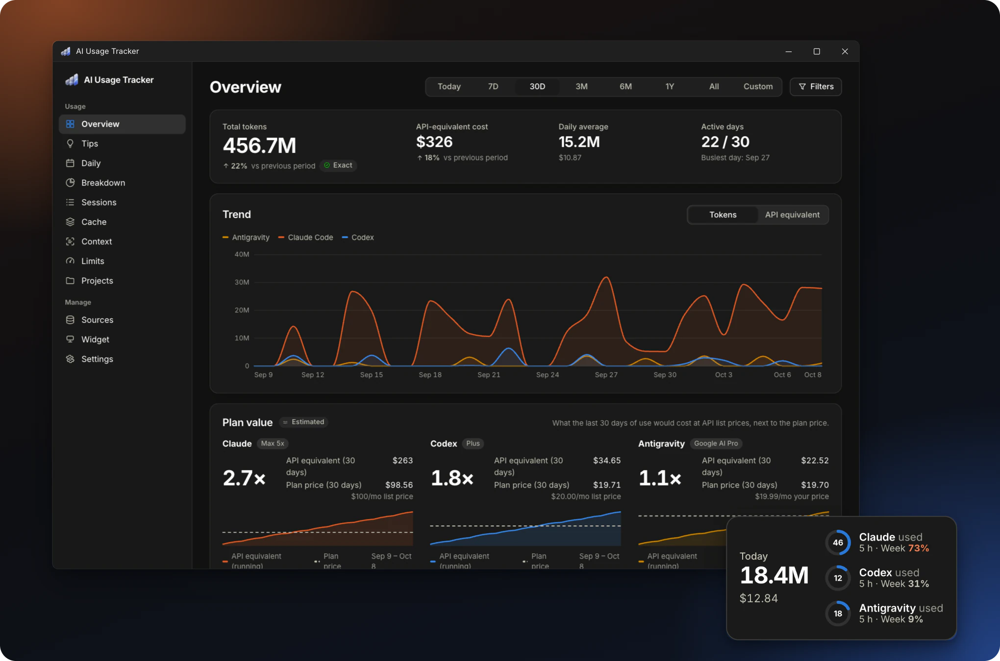

- **Private by design.** Prompts and responses are never stored. Only counts and metadata are kept, in a local SQLite file, and your usage data never leaves the computer.
- **Know where every number comes from.** Every figure is labeled: **Exact** from the tool's own log, **Estimated** by the app, or **Captured** live. Nothing is guessed silently.
- **Stay ahead of your limits.** Five-hour and weekly percentages for Claude and Codex are read every few minutes, with a forecast of when each window fills.

## What sets it apart

- **Track your limits without spending quota.** Your five-hour and weekly percentages come from Claude Code's and Codex's own official interfaces, without a single model request.
- **See when your limit may run out.** The forecast uses your average pace since the window started, so a short burst of work is not projected across the whole window.
- **See what a limit window is worth in API terms.** From the windows it has watched to their end, the app estimates how much API-equivalent use a whole five-hour or weekly window holds.
- **Find the plan that fits your use.** A bigger plan is suggested when your limits keep filling, and a smaller one only when the provider publishes the ratio between plans.
- **Compare what the same work would cost on other models.** Your requests are repriced on every model in the price list, with the same token counts and prompt sizes.
- **See what subagents and tools cost you.** You see how much of your cost comes from subagents and how often each tool's calls fail.
- **Measure what the cache saves you.** You see the hit rate, the net savings, and what it cost when the cache had to be written again after a long pause.
- **Keep your history.** Resumed and forked sessions are never counted twice, and your history stays in the archive even after the tools delete their own logs (Claude Code does so after 30 days).

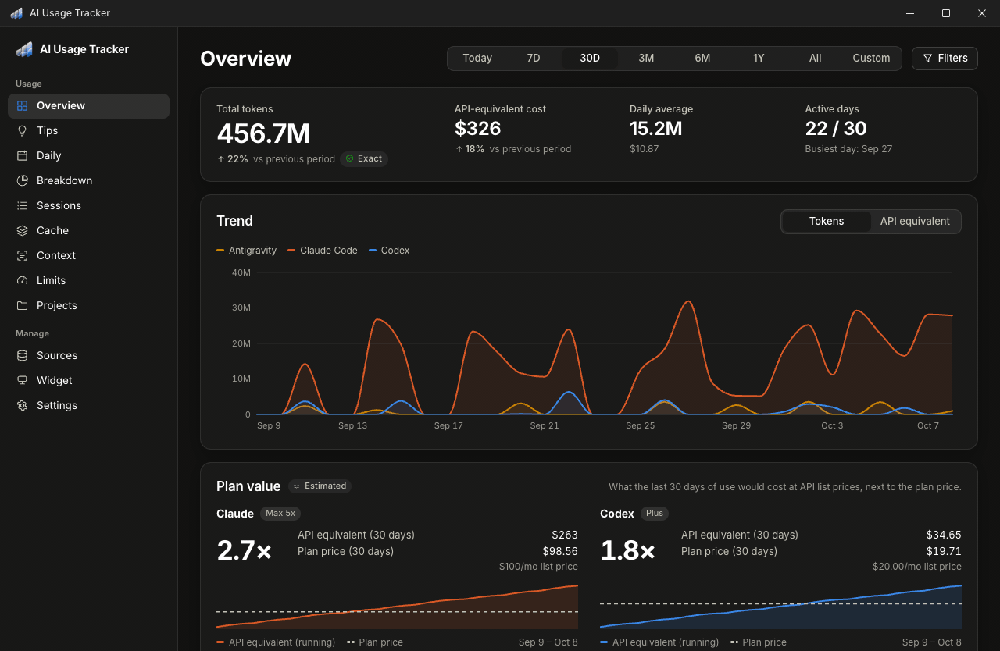

## Features

### Limits that stay current

The app reads the five-hour and weekly limit percentages through Claude Code's and Codex's own interfaces, so the numbers match what the tools show. Each window gets a forecast at its average pace, and each project gets an estimated share of it.

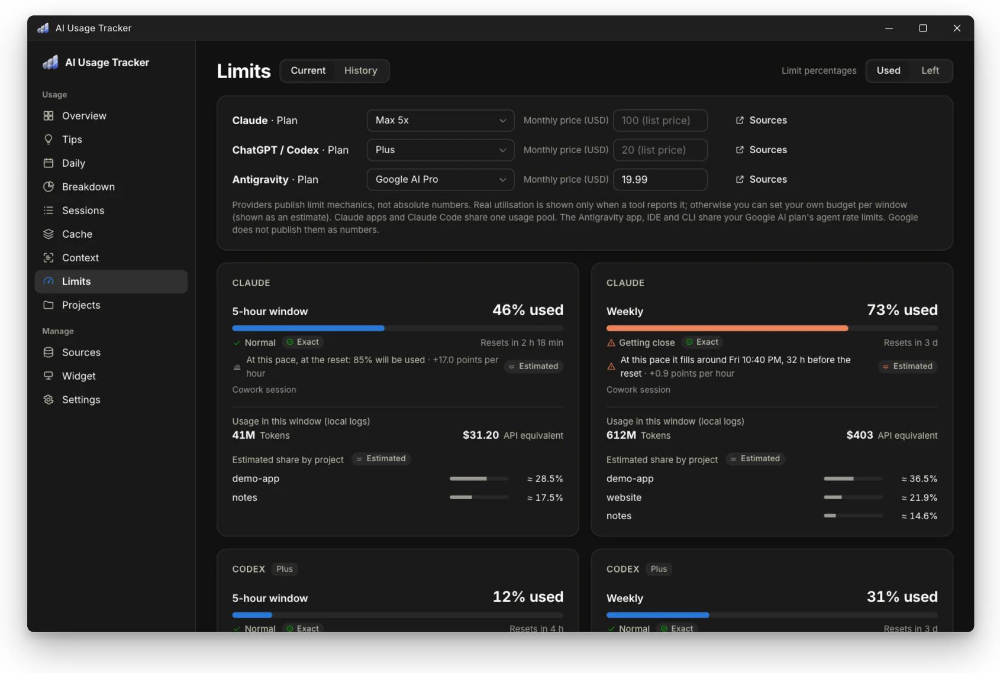

Providers publish how their limits work, not the numbers themselves. The app therefore follows these rules:

- A real percentage appears only when a tool writes one locally or the app reads it live (see [Live capture](#live-capture)).
- If the tool was used after the newest reading, the current value is unknown. It is shown as "?" with the last reading and its age, never as the current value.
- Percentages can read as **used** (as Claude shows them, "15 % used") or **left** (as Codex shows them, "85 % left"). Switch between them in **Settings**, on the **Limits** page, or in the **Widget studio**. Warning colors follow usage either way.
- Without a real reading, you can set your own budget per window. The resulting percentage is labeled **Estimated**.
- Limits are account-wide. A project's share is its fraction of the window's API-equivalent cost and is always **Estimated**.

**Forecast.** Every current limit reading carries a forecast based on the window's **average pace since it started** (current % ÷ time since the window began). Every window starts at 0 % when it resets, so this pace is known and already includes idle hours: a burst of work is not extrapolated as if it never stopped. The app then says when the window would fill ("fills around Sun 21:12, 9 h before the reset") or where it would stand at the reset. No forecast is made in the first tenth of a window, and every forecast is labeled **Estimated**.

### Limit history

The **History** tab on the **Limits** page lists every five-hour and weekly window your readings cover. From those windows, the app estimates what a whole window is worth in API terms.

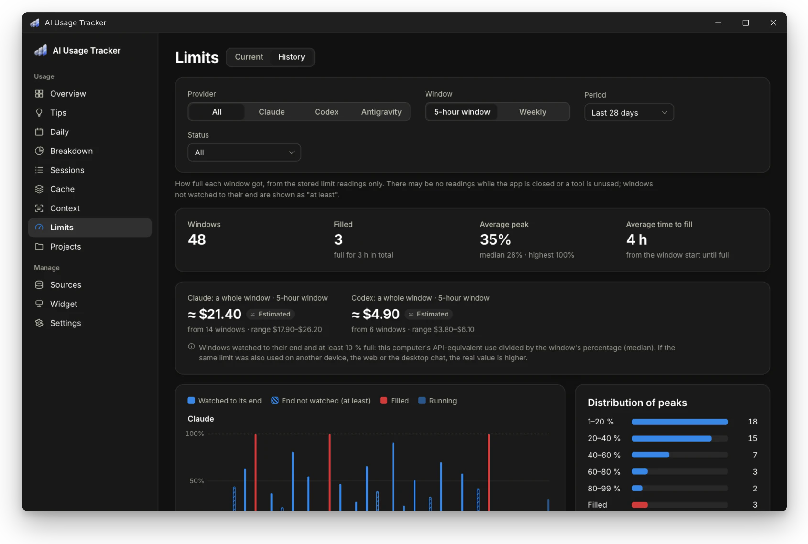

For each window, it shows how full it got, whether it filled, how long it took to fill and how long it stayed full, whether it was watched to its end, and this computer's use inside it (tokens and API-equivalent cost). A window whose end was not watched is shown hatched, as "at least" its highest reading.

- **Filters:** provider, window (five-hour or weekly), period (7 days to all), and status (filled, 80 % and above, or watched to their end).
- **Summary:** the number of windows, how many filled and for how long in total, the average and median peak, the average time to fill, and the distribution of peaks.
- **A whole window in API terms** (an estimate): this computer's API-equivalent use up to the window's highest reading, divided by that percentage. The figure is the median over windows watched to their end and at least 10 % full, shown with its range. If the limit was also used on another device, on the web, or in the desktop chat, the real value is higher.
- **Table:** every window, sortable by start, peak, time to fill, or local use.

### Tips and plan advice

The **Tips** page turns your own records into findings, each with the figures it rests on, what helps, and how it was calculated. Its plan recommendation tells you when your limits keep filling and suggests a smaller plan only when the published ratios back it up.

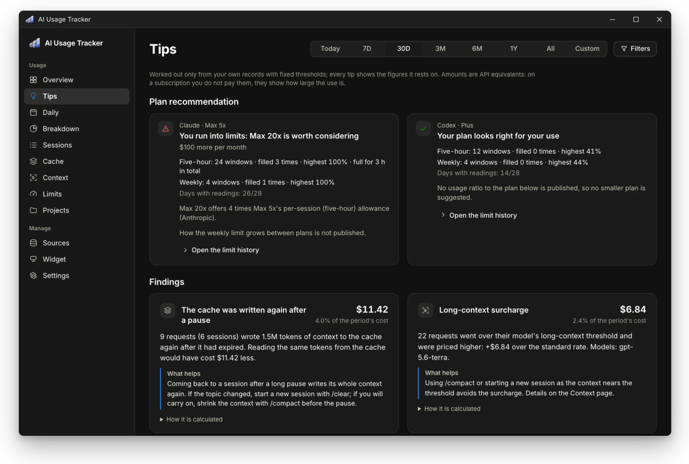

**Plan recommendation.** It covers the last 28 days and rests only on those measurements and on what the providers publish:

- **Limits filled** (a weekly window once, or five-hour windows three times): the next plan up, with its price difference and the published ratio. On Claude, Max 5x and Max 20x give 5 and 20 times Pro's per-session allowance. On ChatGPT, Pro has no five-hour limit. How the weekly limit scales between plans is not published, and the card says so.
- **A smaller plan:** suggested only where the per-session ratio is published (Claude), after 14 days of readings with at least two weekly and five five-hour windows watched to their end, and only if every window would have stayed under 80 % on the plan below. The weekly part is stated as a condition ("if the weekly allowance scales the same way"), never as a fact. OpenAI publishes no ratio between its plans, so no smaller plan is suggested for ChatGPT.
- **Fewer than 7 days of readings:** no recommendation of any kind.

Claude's readings say only "max" for both Max plans, so choose your plan on the **Limits** page. Claude windows read on another plan (Pro against Max) are left out. Codex readings name the plan exactly and are used when none is chosen.

**Tips.** Every rule has a fixed threshold, and an amount must be at least $0.50 and 1 % of the period's cost. The rules look for:

- the cache written again after a long pause. Claude deletes cached content that goes unused for a while (5 minutes or 1 hour), so returning to the same conversation after a break writes it again at a higher price. The app shows that difference against what reading the same content from the cache would have cost. Only content that was already cached counts; what you newly add to the conversation does not
- long-context, fast-mode, and data-residency surcharges, priced against the same requests at the standard rate
- most of the cost coming from requests with more than 100K tokens of context
- tools whose calls return an error 25 % of the time or more (at least 20 calls with a known outcome)

Amounts are API equivalents. On a subscription you do not pay them; they show the size of your use.

**Plan value.** The **Overview** compares each provider's API-equivalent use over the last 30 days with the plan price for those days ("4.7×"), shows a running total against the plan price, and marks the day the plan paid for itself.

- **List prices** come from [`config/plans.json`](config/plans.json), verified on 2026-10-02 against the official pages ([Claude](https://claude.com/pricing), [ChatGPT](https://learn.chatgpt.com/docs/pricing)).
- **Your price:** plans without a fixed price (ChatGPT Pro, Enterprise) ask for one, and you can override any plan's price on the **Limits** page (e.g., for annual billing).
- **Lower bound:** chat use in Claude and ChatGPT is not in local logs, so the real value can be higher.

### Day by day

The **Daily** page shows the period day by day, as columns or, for long periods, as a calendar, in tokens, API-equivalent cost, or requests. It highlights the busiest day, the average per active day, the longest and current streaks of active days, and the weekend share.

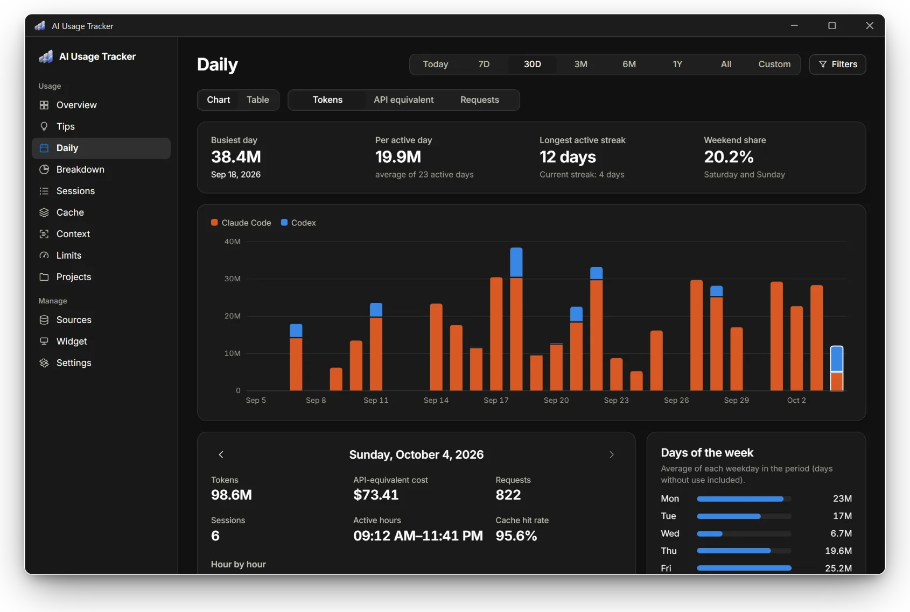

Pick a day, or step through the active days, to see it in detail:

- tokens, cost, requests, and sessions
- first and last activity, and the cache hit rate
- an hour-by-hour chart
- the day's tools, models, and projects
- the day's highest limit readings

Next to it are the average for each weekday and the busiest days.

### What would another model cost?

On the **Breakdown** page, the period's priced requests are repriced on every model in the price list, with the same token counts and prompt sizes, and listed cheapest first against the actual cost.

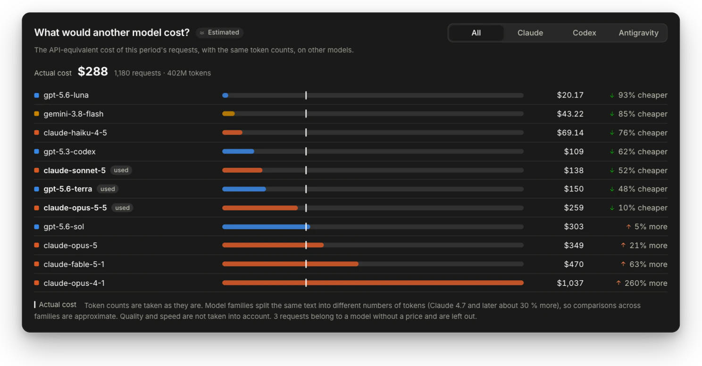

Model families tokenize the same text differently (Claude 4.7 and later use about 30 % more tokens), so comparisons across families are approximate. Quality and speed are not taken into account.

### Subagents and tools

The **Breakdown** page puts subagent costs next to the main conversation and lists the tools the agents call and how often those calls fail.

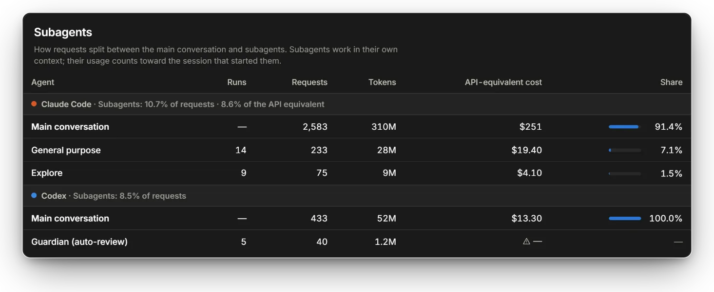

- **Subagents:** the requests, tokens, and API-equivalent cost of subagents (Claude Code agents such as Explore, Codex's guardian auto-review, and others) next to the main conversation. A subagent's usage counts toward the session that started it.
- **Tool use:** how often each tool was called and how many calls returned an error, as the tool itself records the result. MCP tools are grouped by server. Only the tool's name and outcome are stored, never its input or output.

### Explore sessions, cache, context, and projects

Four more pages cover sessions, cache, context, and projects.

| 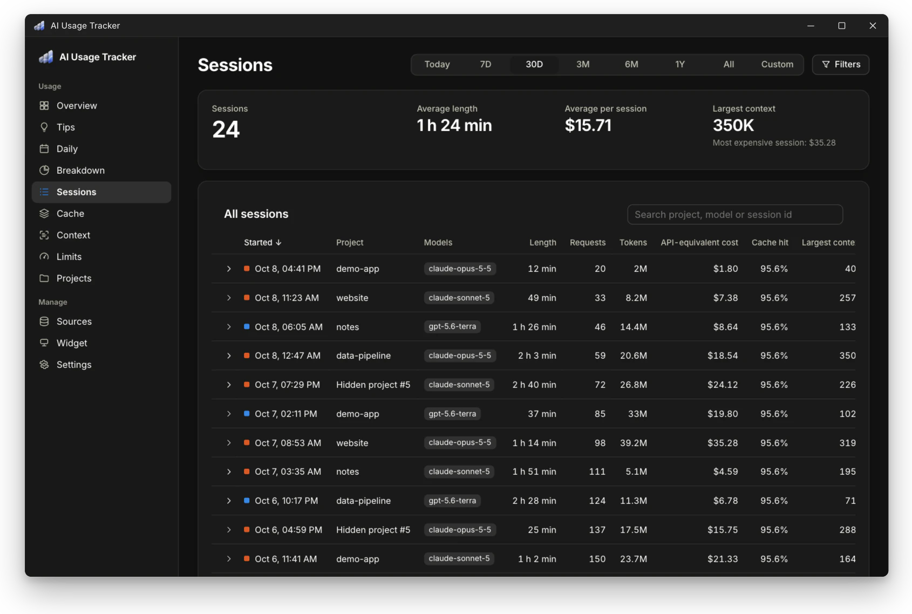 | 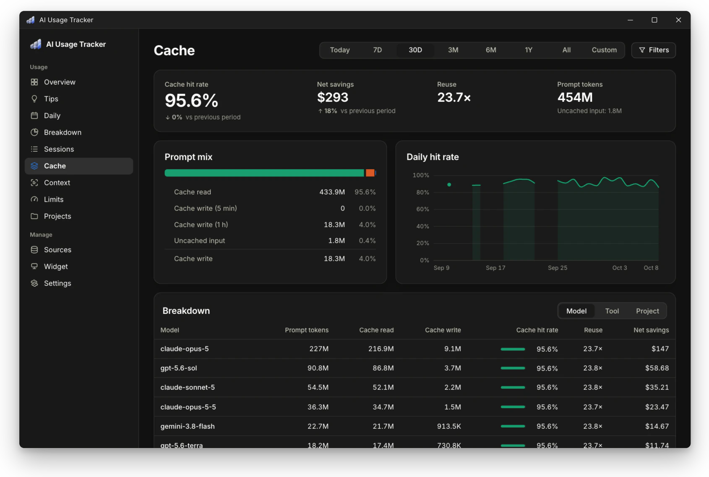 |
|---|---|
| **Sessions**: every session with its length, models, cost, and largest context | **Cache**: hit rate, reuse, and what the cache actually saved |

**Sessions.** The **Sessions** page lists every session in the period with its start, project, models, length (first to last request), requests, tokens, API-equivalent cost, cache hit rate, and largest context. The list is sortable and searchable, and each row opens into a per-model breakdown. Subagent transcripts count toward their parent session.

**Cache.** The **Cache** page shows:

- hit rate (cache read ÷ prompt tokens)
- reuse (read ÷ write) for Claude and for Codex models whose logs record cache writes; older Codex logs record reads only and are left out
- the 5-minute vs. 1-hour write split
- the daily hit rate
- breakdowns by model, tool, and project
- **net savings**: what cache reads saved compared with the full input price, minus the write premium, with each request priced at its own model's rates

Negative savings mean that written cache was not read enough to pay off.

| 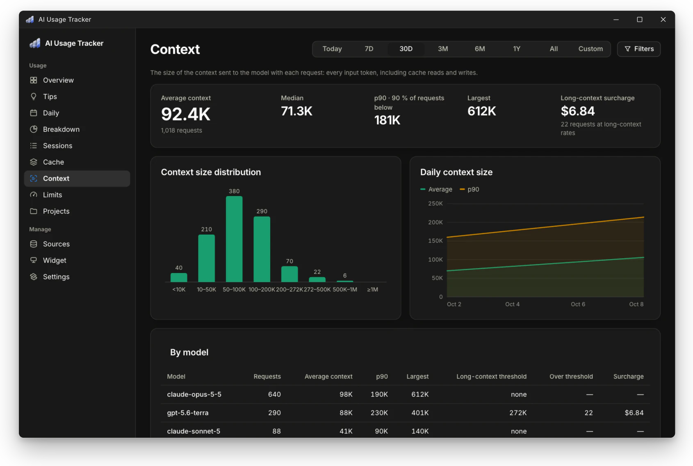 | 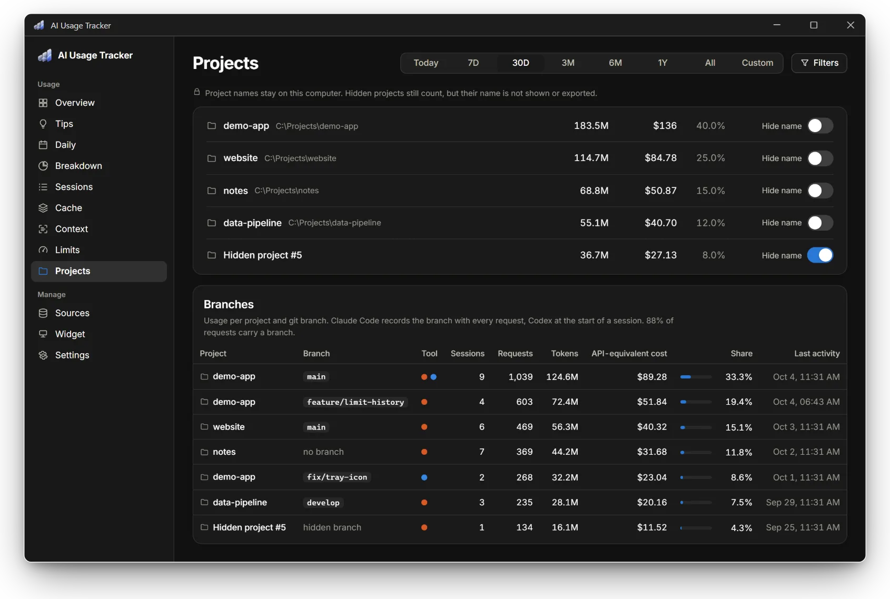 |
|---|---|
| **Context**: how large your prompts get, and the long-context surcharge | **Projects**: usage per project and per git branch |

**Context.** The **Context** page shows how large each request's prompt is (every input token, including cache reads and writes):

- average, median, p90, and largest
- the size distribution (under 10K … over 1M)
- the daily average and p90
- a breakdown per model
- the **long-context surcharge**: what requests above a model's long-context threshold (272K for GPT-5.x) cost beyond the standard rates

**Branches.** The **Projects** page splits each project's usage by git branch. Claude Code records the branch with every request; Codex records it when a session starts in a repository. Requests outside a repository show as "no branch".

### A widget that stays out of the way

An always-on-top mini window sits by default in the bottom-right corner, just above the taskbar. It sizes itself to its content and, when snapped to a corner, stays flush with that corner while it resizes. Dragging it leaves it where you drop it.

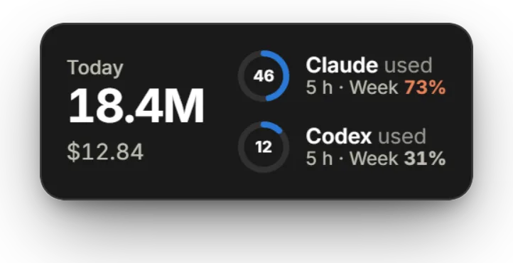

The **Widget studio** page changes what the widget shows and how it looks, with a live preview.

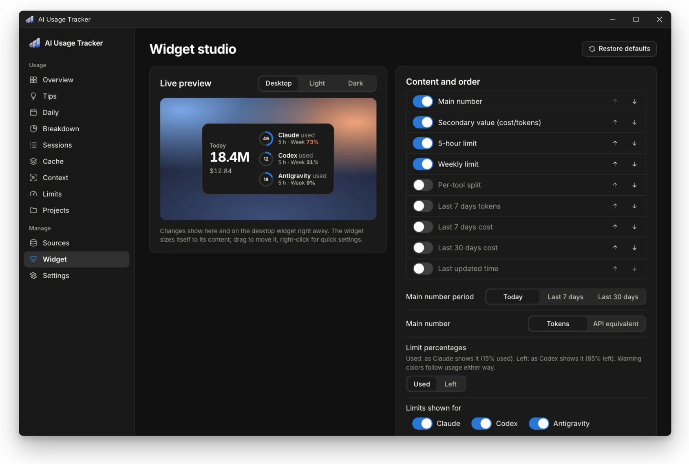

- **Content:** the items shown and their order (main number, secondary value, five-hour and weekly limits, per-tool split, 7- and 30-day totals, and last update time)
- **Layout:** horizontal, vertical, or a single line
- **Limit style:** ring, bar, or text
- **Look:** theme, accent color, scale, background opacity, corner radius, border, shadow, labels, and time until reset
- **Text:** any font installed on the computer (searchable and shown in its own face), text size, main-number size, number weight, and fixed-width digits
- **Thresholds:** caution and critical levels
- **Behavior:** always on top, position lock, click action, full-screen hiding, snap to a corner, and which providers to show

The widget also comes with a tray icon and a shortcut:

- **Tray icon** (next to the clock on the taskbar): it can show a limit's percentage, either the fullest current one or one you pick, in the widget's warning colors. Hovering over it lists every limit. Set it up under **Settings → Tray icon**.
- **Shortcut:** a system-wide key combination shows or hides the widget (default **Ctrl+Alt+Shift+W**). To change it, open **Settings → Widget** and press the new combination. A combination that another program owns is refused.

### Weekly PDF, export, and your own prices

**Weekly summary (PDF).** **Settings → Weekly summary (PDF)** saves last week, this week, or the last 7 days as an A4 PDF. It contains totals with the change from the previous period, a daily chart, tools, plan value, current limits with their forecast, context, models, projects (hidden names stay hidden), the most expensive sessions, and notes. No print dialog opens. Optionally, the app saves the last full week (Monday to Sunday) to a folder (default `Documents\AI Usage Tracker`) whenever its file is not there yet, so a week missed while the computer was off is saved at the next start.

**Archive and data.** Source tools may delete old logs; the Claude Code CLI, for example, deletes sessions after 30 days by default. Everything this app has imported stays in its archive, and no record is ever counted twice (see [How it works](#how-it-works)).

**Settings → Data** offers:

- CSV or JSON export (per request or as a daily summary)
- database backup
- merge-import from a backup
- **Delete all my data**, which empties the archive and stops recording until you confirm your sources again. Backups and exports you saved elsewhere are not touched.

**Prices.** Official API list prices ship with the app in [`config/pricing.json`](config/pricing.json), verified on 2026-10-02 against the official [Anthropic](https://platform.claude.com/docs/en/about-claude/pricing) and [OpenAI](https://developers.openai.com/api/docs/pricing) pages.

- **Pricing rules covered:** 5-minute and 1-hour cache writes, the OpenAI long-context tier (>272K input tokens), fast-mode and US data-residency multipliers, and web-search fees.
- **Unknown models:** never priced by guesswork. They are listed as "no price" and left out of costs. You can dismiss the overview warning about them; it returns only if another model becomes unpriced, or through **Settings → Prices → Show the warning again**.
- **Edits:** change prices in **Settings → Prices**. Your copy is stored in `%LOCALAPPDATA%\AIUsageTracker\pricing.json`. You can also map an unpriced model to another model's price or restore the defaults.

## Supported sources

| Source | What is read | Tokens | Limits | Notes |
|---|---|---|---|---|
| **Claude Code** (CLI, VS Code, Claude desktop "Code") | `%CLAUDE_CONFIG_DIR%` or `%USERPROFILE%\.claude\projects\**\*.jsonl` | **Exact** | Only when a limit is hit | Background helper calls (e.g., web-search summarization) are not in these logs |
| **Cowork sessions** (Claude desktop) | `%APPDATA%\Claude\local-agent-mode-sessions\**` | **Exact** | **Exact %** (5 h / 7 d) | Only tasks that ran on your computer. New Cowork tasks run in the cloud: their token counts are not stored on your computer, but they count toward your plan limits |
| **Claude desktop: plan usage** | `%APPDATA%\Claude\plan-usage-history.json` | — | **Exact %** | Chat tokens are not stored locally, so **none** |
| **Codex** (CLI and desktop) | `%CODEX_HOME%` or `%USERPROFILE%\.codex\{sessions,archived_sessions}` | **Exact** | **Exact %** (every request) | |
| ChatGPT desktop | — | **None** | — | Detection only |

Every figure carries a label:

- **Exact:** the value the tool wrote into its own log.
- **Estimated:** a value this app computed, e.g., a project's share of a limit or a percentage of a budget you set.
- **Captured:** a value the app read live (see [Live capture](#live-capture)) through the limit reads, the status-line bridge, or the local telemetry receiver.

## Install

1. Download `AI-Usage-Tracker_x.y.z_x64-setup.exe` from the [latest release](../../releases/latest) and run it. The installer is **per-user** (it installs to `%LOCALAPPDATA%\AI Usage Tracker`) and needs no administrator rights.
2. Windows 11 already includes WebView2. On Windows 10, the installer adds it if it is missing.
3. On first launch, the app lists the tools it found on this computer. Choose the sources you want and press **Get started**. Nothing is read until you confirm.

> **SmartScreen.** The installer is not code-signed, so Windows may show "Unknown publisher". Choose **More info → Run anyway**.

**Uninstall.** Use Windows Settings → Apps. Ticking "Delete the application data" also removes `%LOCALAPPDATA%\AIUsageTracker`. The start-with-Windows entry is always removed.

## Privacy

> **Content is never stored.** The app takes only details such as token counts, model, and time from the logs; prompt and response text is never saved anywhere. Your usage data never leaves your computer, and the app has no telemetry.

- **Read:** timestamps, model, project folder, session ID, token counts, and limit percentages from the tools' own logs.
- **Stored:** only those values, in `%LOCALAPPDATA%\AIUsageTracker\tracker.db` (SQLite). Project names stay local. You can hide them one by one or all at once, and hidden names are masked in exports too.
- **Never stored:** prompts, responses, file contents, credentials, or tokens. The app does **not** read the tools' credential files.
- **Network:** the app itself connects only to check for updates. The check downloads the release's version file and sends nothing (**Settings → Updates**). The limit reads, on by default, run your own Claude Code and Codex, which ask their own services for your plan's limit percentages; the app starts them with their telemetry and error reporting turned off. You can turn the reads off under **Sources → Live capture**. Prices and plans ship with the app, and currency conversion uses a rate you enter yourself.

### Live capture

**Sources → Live capture** has four switches. The two **limit reads are on by default**: they change no files, make no model request, and use only your own Claude Code or Codex sign-in. The two methods that edit Claude Code's settings file are **off by default**. Each switch shows exactly what it changes, and turning it off undoes the change. The uninstaller reverts them too, but not during updates.

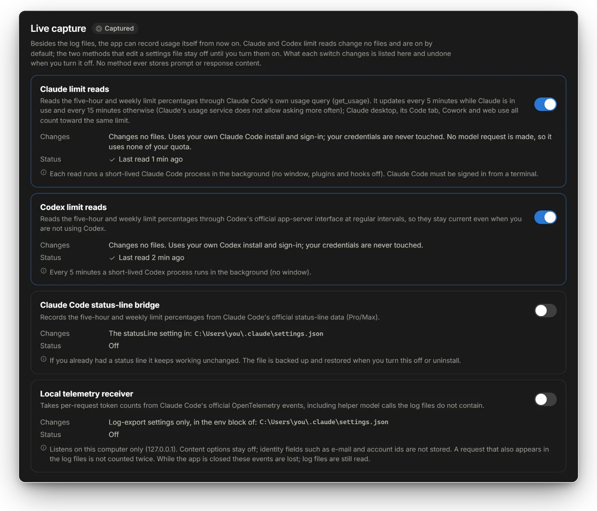

| Method | What it does | What it changes |
|---|---|---|
| **Claude limit reads** | Reads the five-hour and weekly limit percentages through Claude Code's own usage query. No model request is made, so no quota is used. It updates every 5 minutes while Claude is in use and every 15 minutes otherwise, because Claude's usage service does not allow more frequent requests. Claude desktop chat, its Code tab, Cowork, and web use are all reflected. Requires Claude Code signed in with a Pro or Max account (`claude` → `/login`). | Nothing. It uses your own Claude Code install and sign-in, turns off MCP servers and hooks as well as telemetry, error reporting, and auto-update for the read, and never touches credentials. |
| **Codex limit reads** | Reads the five-hour and weekly limit percentages every 5 minutes through Codex's official interface, so they stay current even when you are not using Codex. | Nothing. It uses your own Codex install and sign-in with analytics turned off, and never touches credentials. |
| **Claude Code status-line bridge** | Records the five-hour and weekly limit percentages from Claude Code's official `statusLine` data (Pro/Max). An existing status line keeps running with the same input. It works where Claude Code shows a status line (the terminal); the Code tab of the Claude desktop app does not run status lines. | `statusLine` in `~/.claude/settings.json` (backed up first). |
| **Local telemetry receiver** | Takes per-request token counts from Claude Code's official telemetry, including helper-model calls that the transcripts lack. | Log-export variables only, in the `env` block of `~/.claude/settings.json`. It listens on `127.0.0.1` only and accepts only requests that carry a key generated for this install. |

Safeguards:

- A request that shows up both in telemetry and in a transcript is counted once.
- Email addresses and account IDs are never stored, and prompt logging is never turned on.
- If you already have your own telemetry setup, the app leaves it alone and tells you.
- Turning a switch off reverts only what the app wrote; changes you made yourself stay.

## How it works

Everything runs on your computer:

1. Claude Code, Cowork, Claude desktop, and the Codex CLI and desktop app write usage logs to disk, as they already do.
2. The app reads each log from where it left off, so a rescan only touches what is new. It takes only details such as token counts, model, and time; prompt and response text is never saved anywhere.
3. When the limit reads are on, your own `claude` and `codex` CLIs supply the limit percentages.
4. Only counts and metadata reach the local archive (SQLite). Duplicates from streaming, resumed or forked sessions, and Codex logs moved to the archive are counted once.
5. The dashboard, widget, tray icon, and weekly PDF read from that archive.

## Updates

The app checks for a new version at startup and every 6 hours. The check downloads only a small version file from this repository's releases and sends nothing. An update is installed only after you confirm it, and only if its signature matches the key built into the app. You can turn the check off under **Settings → Updates**.

## Known limitations

- **Claude Code totals:** helper calls outside the main model are missing from its logs, so totals can be slightly low.
- **Desktop chats:** Claude and ChatGPT desktop chat tokens are not available locally.
- **Codex fast tier:** not recorded per request, so the standard price is used.
- **Telemetry-only requests:** for requests known only from the local telemetry receiver, cache writes are priced at the 5-minute rate, so their cost can be slightly low.
- **`codex-auto-review`:** has no published price.
- **Log formats:** these are not documented interfaces and may change. The app skips unknown fields and lists unrecognized files under **Sources**.

## Build from source

Requirements: Rust 1.90+ (MSVC), Node 20.19+ or 22.12+, and Visual Studio Build Tools (C++).

```bash
npm --prefix ui install
cargo test -p tracker-core
npx --prefix ui tauri dev
npm --prefix ui run release        # installer → target/release/bundle/
```

Running `npm --prefix ui run dev` on its own opens the dashboard in a browser with sample data.

| Path | Contents |
|---|---|
| `crates/tracker-core` | discovery, parsers, SQLite archive, pricing, analytics, and export (plus synthetic fixtures) |
| `src-tauri` | desktop shell: worker, file watching, tray, widget, and IPC |
| `ui` | Svelte 5 dashboard and widget |
| `config` | `pricing.json`, `plans.json`, and `updates.json` (release location) |

Bug reports and pull requests are welcome.

## Code signing policy

See [CODE_SIGNING.md](CODE_SIGNING.md).

## License

[MIT](LICENSE)
