# AI Usage Tracker

**Claude Code ve Codex kullanımınızı, API eşdeğeri maliyetinizi ve plan limitlerinizi tek yerden izleyin.**

AI Usage Tracker, yapay zekâ araçlarınızın bilgisayarınıza zaten yazdığı kullanım kayıtlarını okur ve size anlaşılır bir panelde sunar. Ne kadar token harcadığınızı, bu kullanımın API fiyatlarıyla ne tutacağını ve limitlerinizin ne zaman dolacağını görürsünüz. Hesap açmanız gerekmez; verileriniz bulutta değil, kendi bilgisayarınızda kalır.

[](../../releases/latest)

 [](LICENSE)

[Özellikler](#özellikler) · [Kurulum](#kurulum) · [Gizlilik](#gizlilik) · [Nasıl çalışır](#nasıl-çalışır) · [Kaynaktan derleme](#kaynaktan-derleme) · [English](README.md)

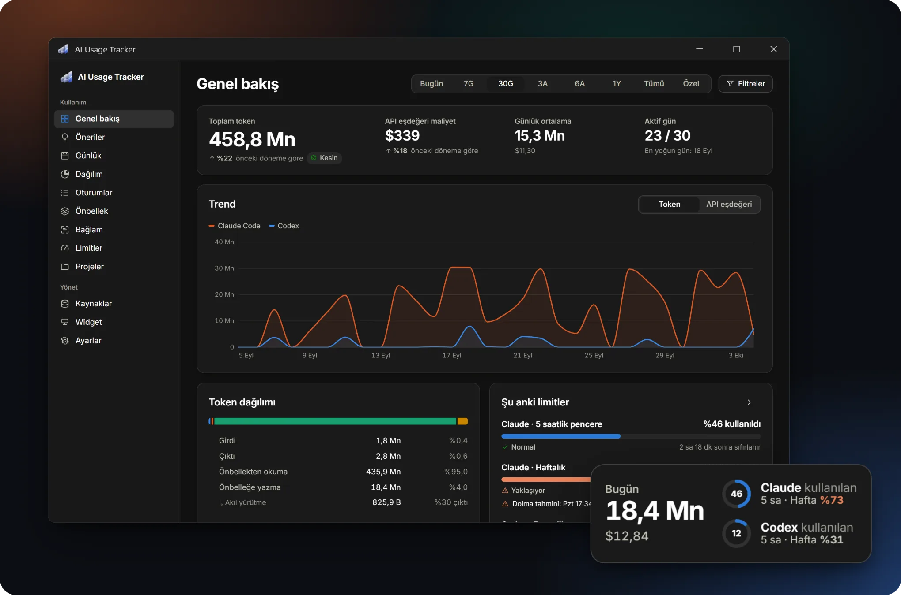

- **Verileriniz sizde kalır.** Prompt ve yanıtlarınız hiçbir zaman kaydedilmez. Uygulama yalnızca sayıları ve meta verileri bilgisayarınızdaki bir dosyada tutar ve hiçbir yere göndermez.
- **Her sayının nereden geldiğini bilirsiniz.** Araçtan doğrudan okunan değerler **Kesin**, uygulamanın hesapladıkları **Tahmini**, canlı okunanlar **Yakalanan** etiketiyle gösterilir. Hiçbir değer sessizce tahmin edilmez.
- **Limitinize takılmadan çalışın.** Claude ve Codex'in 5 saatlik ve haftalık limitlerini birkaç dakikada bir güncel olarak görür, ne zaman dolacaklarını önceden öğrenirsiniz.

## Öne çıkan özellikler

- **Limitlerinizi kotanızdan harcamadan izleyin.** Limit yüzdeleri Claude Code'un ve Codex'in kendi resmi arayüzlerinden okunur. Bunun için modele tek bir istek bile gönderilmez.
- **Limitinizin ne zaman dolabileceğini görün.** Tahmin, pencerenin başından bu yana ortalama hızınıza dayanır. Kısa süreli bir yoğunluk, bütün hafta öyle geçecekmiş gibi hesaplanmaz.
- **Limit pencerenizin tahmini API eşdeğerini görün.** Uygulama, sonuna kadar izlediği pencerelerden yola çıkarak 5 saatlik ya da haftalık bir pencerenin API fiyatlarıyla ne kadar kullanıma denk geldiğini hesaplar.
- **Size uygun planı öğrenin.** Limitleriniz sık doluyorsa bir üst plan önerilir. Daha küçük bir plan ise yalnızca sağlayıcının yayımladığı oranlar bunu destekliyorsa önerilir.
- **Aynı işin başka bir modelle ne tutacağını karşılaştırın.** İstekleriniz aynı token sayıları ve bağlam boyutlarıyla fiyat listesindeki her modele göre yeniden fiyatlanır.
- **Alt ajanların ve araçların payını görün.** Maliyetin ne kadarının alt ajanlardan geldiğini ve hangi araçların ne sıklıkla hata verdiğini görürsünüz.
- **Önbelleğin size ne kazandırdığını ölçün.** İsabet oranını, net tasarrufu ve uzun bir aradan sonra önbelleğin yeniden yazılmasının maliyetini görürsünüz.
- **Geçmişinizi kaybetmeyin.** Devam ettirdiğiniz ya da kopyasından yeni oturum açtığınız sohbetler iki kez sayılmaz. Claude Code kayıtlarını 30 gün sonra silse bile geçmişiniz uygulamanın veri tabanında kalır.

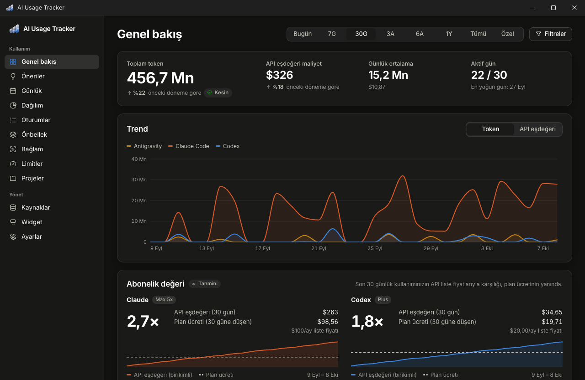

## Özellikler

### Limitlerinizi anlık izleyin

5 saatlik ve haftalık limit yüzdeleriniz Claude Code'un ve Codex'in kendi arayüzlerinden okunur; gördüğünüz sayılar araçların gösterdiğiyle aynıdır. Her pencerenin ne zaman dolacağını ve her projenin limitin ne kadarını kullandığını görürsünüz.

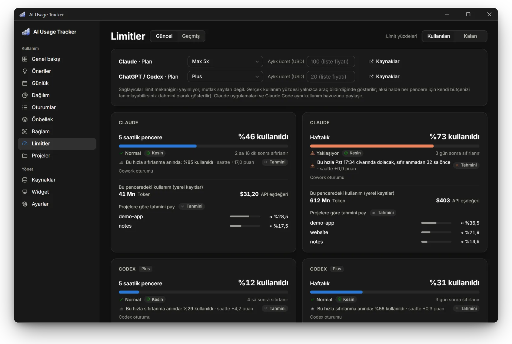

Sağlayıcılar limitlerin sayısal karşılığını yayımlamıyor, yalnızca nasıl işlediklerini açıklıyor. Bu yüzden uygulama şu kurallara uyar:

- Gerçek yüzde yalnızca araç bunu kendi kaydına yazdığında ya da uygulama canlı okuduğunda gösterilir (bkz. [Canlı yakalama](#canlı-yakalama)).
- Son okumadan sonra aracı kullandıysanız güncel değer bilinemez. Bu durumda "?" görürsünüz; yanında son okuma ve ne kadar önce yapıldığı yazar. Eski bir değer hiçbir zaman güncelmiş gibi gösterilmez.
- Yüzdeleri **kullanılan** ("%15 kullanıldı", Claude'daki gibi) ya da **kalan** ("%85 kaldı", Codex'teki gibi) olarak görebilirsiniz. Bu tercihi **Ayarlar**'dan, **Limitler** sayfasından ya da **Widget stüdyosu**'ndan değiştirirsiniz. Uyarı renkleri her iki durumda da kullanıma göre değişir.
- Okuma yoksa her pencere için kendi bütçenizi belirleyebilirsiniz, örneğin "5 saatte 50 $ API eşdeğeri". Bu bütçeye göre hesaplanan yüzde **Tahmini** olarak gösterilir.
- Limitler hesabınızın tamamı için geçerlidir. Bir projenin payı, o penceredeki API eşdeğeri maliyetten aldığı paya göre hesaplanır ve **Tahmini** olarak gösterilir.

**Dolma tahmini.** Uygulama her güncel okumada, pencerenin **başından bu yana ortalama hızınıza** göre bir tahmin yapar (şu anki yüzde ÷ pencere başladığından bu yana geçen süre). Her pencere %0'dan başladığı için bu hız kesin olarak bilinir ve boşta geçen saatleri de içerir; kısa bir yoğunluk hiç bitmeyecekmiş gibi ileriye taşınmaz. Sonuçta pencerenin ne zaman dolacağını ("Paz 21:12 civarında dolacak, sıfırlanmadan 9 sa önce") ya da sıfırlandığında hangi seviyede olacağını görürsünüz. Pencerenin ilk onda birinde tahmin yapılmaz. Tahminler **Tahmini** etiketi taşır.

### Geçmiş limit pencerelerinizi inceleyin

**Limitler** sayfasındaki **Geçmiş** sekmesinde her 5 saatlik ve haftalık pencerenizi görürsünüz: ne kadar dolduğunu, dolup dolmadığını, ne kadar sürede dolduğunu ve o sırada bu bilgisayarda ne kadar kullandığınızı. Uygulama bu pencerelerden yola çıkarak bir pencerenin tamamının API eşdeğeri olarak kaça denk geldiğini de tahmin eder.

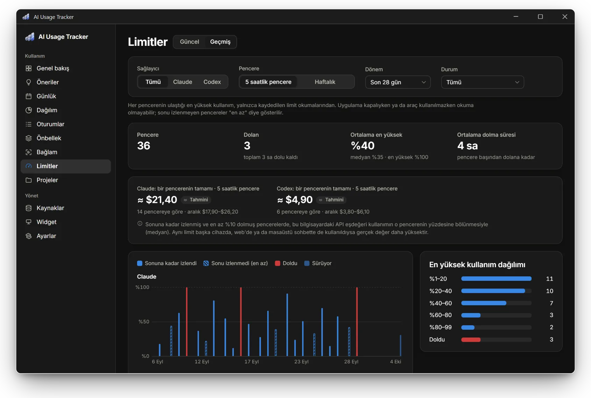

Her pencere için ne kadar süre dolu kaldığı ve sonuna kadar izlenip izlenmediği de yazar. Kullanım token ve API eşdeğeri olarak gösterilir. Sonu izlenmemiş pencereler taralı çizilir; bunların en yüksek okuması "en az" olarak okunmalıdır.

- **Filtreler:** sağlayıcı, pencere (5 saatlik ya da haftalık), dönem (7 günden tümüne kadar), durum (dolanlar, %80 ve üzeri, sonuna kadar izlenenler).
- **Özet:** kaç pencere olduğu, kaçının dolduğu ve toplamda ne kadar süre dolu kaldığı, en yüksek kullanımın ortalaması ve medyanı, ortalama dolma süresi ve en yüksek kullanımların dağılımı.
- **Bir pencerenin tamamı API cinsinden** (tahmini): Sonuna kadar izlenmiş ve en az %10 dolmuş her pencerede, bu bilgisayardaki API eşdeğeri kullanım en yüksek okumaya kadar toplanır ve o yüzdeye bölünür. Gösterilen değer bu sonuçların medyanı ve aralığıdır. Aynı limiti başka bir cihazda, web'de ya da masaüstü sohbette de kullandıysanız gerçek değer daha yüksektir.
- **Tablo:** tüm pencereler; başlangıca, en yüksek kullanıma, dolma süresine ya da yerel kullanıma göre sıralanabilir.

### Size uygun planı ve tasarruf fırsatlarını bulun

**Öneriler** sayfası kendi kayıtlarınızdan bulgular çıkarır. Her bulgu dayandığı sayıları, ne yapabileceğinizi ve nasıl hesaplandığını gösterir. **Plan önerisi** de limitleriniz sık doluyorsa bunu söyler; daha küçük bir planı ise yalnızca yayımlanmış oranlar destekliyorsa önerir.

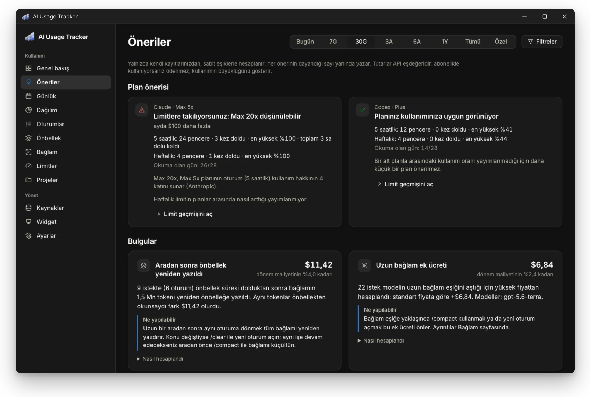

**Plan önerisi.** Son 28 güne bakar; yalnızca bu ölçümlere ve sağlayıcıların yayımladığı bilgilere dayanır:

- **Limitleriniz dolduysa** (bir haftalık pencere bir kez ya da 5 saatlik pencereler üç kez): Bir üst plan, fiyat farkı ve yayımlanmış oranıyla birlikte önerilir. Claude'da Max 5x ve Max 20x, Pro'nun oturum başına kullanım hakkının 5 ve 20 katını verir. ChatGPT'de Pro planının 5 saatlik limiti yoktur. Haftalık limitin planlar arasında nasıl arttığı yayımlanmadığı için kart bunu ayrıca belirtir.
- **Daha küçük plan:** Yalnızca oturum oranının yayımlandığı durumlarda (Claude) önerilir. Bunun için en az 14 günlük okuma ve sonuna kadar izlenmiş en az iki haftalık ve beş adet 5 saatlik pencere gerekir. Ayrıca her pencerenin alt planda %80'in altında kalması gerekir. Haftalık kısım kesin bir bilgi olarak değil, bir koşul olarak yazılır ("haftalık hak da aynı oranda olsaydı"). OpenAI planları arasındaki oranı yayımlamadığı için ChatGPT'de daha küçük plan önerilmez.
- **7 günden az okuma varsa** hiçbir öneri yapılmaz.

Claude okumaları iki Max planı için de yalnızca "max" der; bu yüzden planınızı **Limitler** sayfasından seçin. Seçtiğiniz plandan farklı bir planda okunmuş Claude pencereleri (Pro ile Max arasında) hesaba katılmaz. Codex okumaları planın adını tam olarak içerir ve siz plan seçmediyseniz bu bilgi kullanılır.

**Bulgular.** Her kuralın sabit bir eşiği vardır. Bir bulgunun gösterilmesi için tutarın en az 0,50 $ olması ve dönem maliyetinin en az %1'ine ulaşması gerekir. Uygulama şunlara bakar:

- Uzun bir aradan sonra önbelleğin baştan yazılması. Claude, önbelleğe aldığı içeriği bir süre kullanılmazsa (5 dakika ya da 1 saat) siler. Ara verip aynı sohbete döndüğünüzde bu içerik yeniden yazılır ve daha pahalıya gelir. Uygulama bu farkı, aynı içerik önbellekten okunsaydı ne tutacağıyla karşılaştırarak gösterir. Yalnızca daha önce önbellekte olan içerik hesaba katılır; sohbete yeni eklediğiniz kısım sayılmaz.
- Uzun bağlam, hızlı mod ve veri yerleşimi ek ücretleri. Aynı isteklerin standart fiyatıyla karşılaştırılır.
- Maliyetin büyük kısmının bağlamı 100K token'ı aşan isteklerden gelmesi.
- Çağrılarının %25'i ya da daha fazlası hata veren araçlar (sonucu bilinen en az 20 çağrı).

Tutarlar API eşdeğeridir. Abonelikle kullanıyorsanız bu tutarları ödemezsiniz; tutarlar kullanımınızın büyüklüğünü gösterir.

**Abonelik değeri.** **Genel bakış** sayfası, son 30 günde her sağlayıcıdaki API eşdeğeri kullanımınızı planınızın bu günlere düşen ücretiyle karşılaştırır ("4,7×"). Birikimli kullanımınız plan ücretiyle aynı grafikte çizilir ve planın kendini kaçıncı gün amorti ettiği gösterilir.

- **Liste fiyatları** [`config/plans.json`](config/plans.json) dosyasındadır ve 2026-10-02'de resmi sayfalardan doğrulanmıştır ([Claude](https://claude.com/pricing), [ChatGPT](https://learn.chatgpt.com/docs/pricing)).
- **Kendi fiyatınız:** Sabit fiyatı olmayan planlarda (ChatGPT Pro, Enterprise) fiyatı siz girersiniz. Her planın fiyatını **Limitler** sayfasından değiştirebilirsiniz (örneğin yıllık ödüyorsanız).
- **Alt sınır:** Claude ve ChatGPT'deki sohbet kullanımı yerel kayıtlarda olmadığı için gerçek değer daha yüksek olabilir.

### Kullanımınızı gün gün görün

**Günlük** sayfası seçtiğiniz dönemi gün gün gösterir. Kısa dönemlerde sütunlar, uzun dönemlerde takvim görürsünüz; değerleri token, API eşdeğeri ya da istek sayısı olarak seçebilirsiniz.

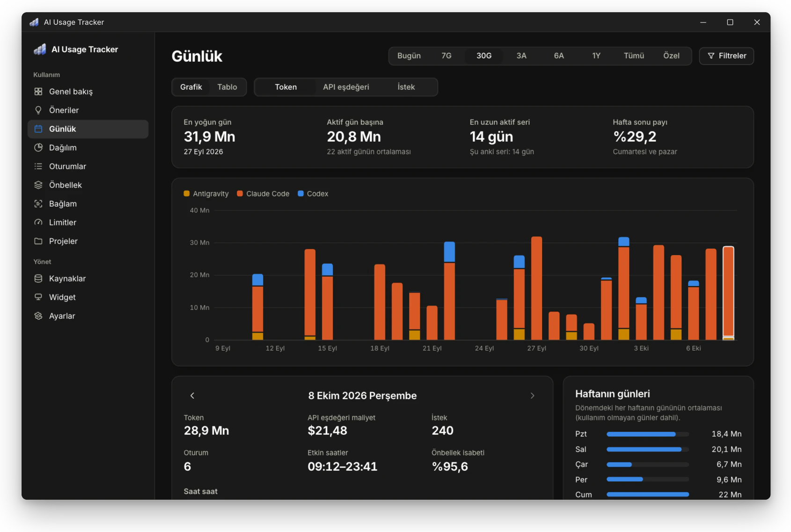

Sayfanın üstünde en yoğun gününüz, aktif gün başına ortalamanız, en uzun ve şu anki aktif gün seriniz ve hafta sonu payınız yer alır. Bir gün seçtiğinizde ya da aktif günler arasında gezindiğinizde o günün ayrıntıları açılır: token, maliyet, istek, oturum, ilk ve son etkinlik, önbellek isabeti, saat saat grafik, kullandığınız araçlar, modeller ve projeler, o gün ulaşılan en yüksek limit okumaları. Yanında haftanın her gününün ortalamasını ve en yoğun günlerinizi görürsünüz.

### Aynı işin başka bir modelle ne tutacağını görün

**Dağılım** sayfası, ilgili dönemdeki isteklerinizi aynı token sayıları ve bağlam boyutlarıyla fiyat listesindeki her modele göre yeniden hesaplar. Sonuçları gerçek maliyetinizle birlikte, en ucuzdan en pahalıya doğru görürsünüz.

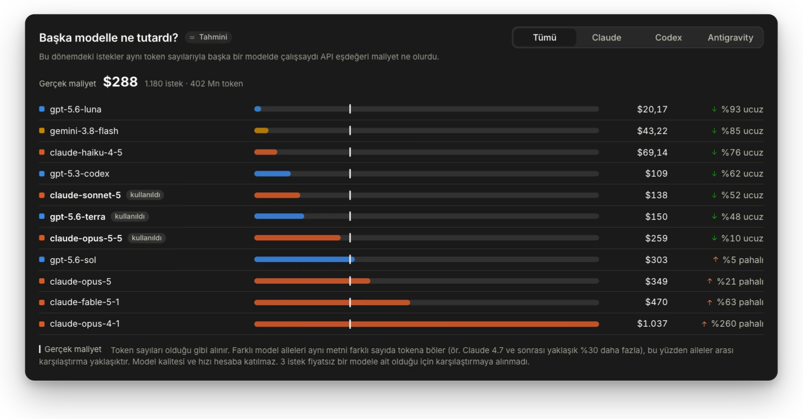

Model aileleri aynı metni farklı sayıda token'a böler (Claude 4.7 ve sonrası yaklaşık %30 daha fazla token üretir). Bu yüzden farklı aileler arasındaki karşılaştırma yaklaşıktır; kalite ve hız hesaba katılmaz.

### Alt ajanların ve araçların payını görün

**Dağılım** sayfası, alt ajanlarınızın ana konuşmanın yanında ne kadar tuttuğunu, ajanların hangi araçları çağırdığını ve bu çağrıların ne sıklıkla hata verdiğini gösterir.

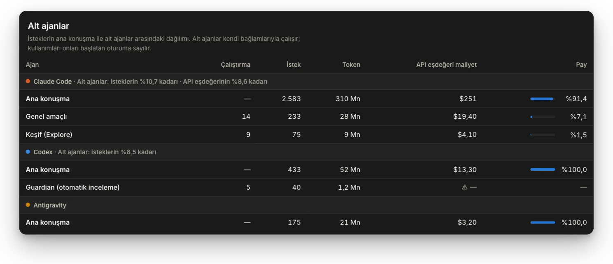

- **Alt ajanlar:** Alt ajanların (Explore gibi Claude Code ajanları, Codex'in guardian otomatik incelemesi vb.) istek, token ve API eşdeğeri maliyeti, ana konuşmayla yan yana gösterilir. Bir alt ajanın kullanımı onu başlatan oturuma sayılır.
- **Araç kullanımı:** Her aracın kaç kez çağrıldığını ve çağrıların ne kadarının hata verdiğini görürsünüz. Hata bilgisi, aracın kendi kaydettiği sonuçtan alınır. MCP araçları sunucuya göre gruplanır. Yalnızca aracın adı ve sonucu saklanır; girdileri ve çıktıları hiçbir zaman saklanmaz.

### Oturumlarınızı, önbelleği, bağlamı ve projelerinizi inceleyin

| 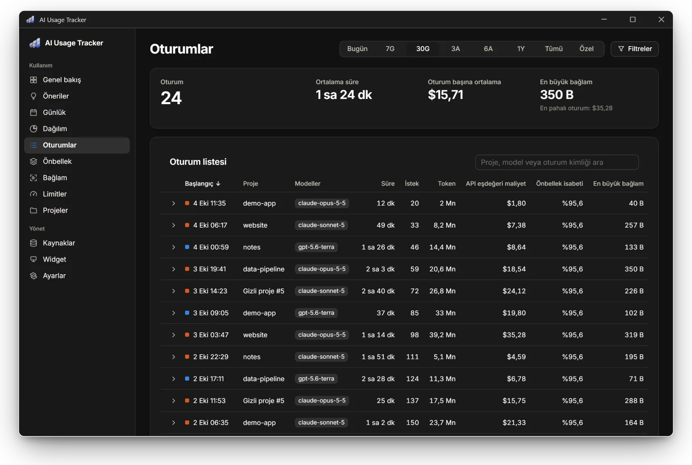                              | 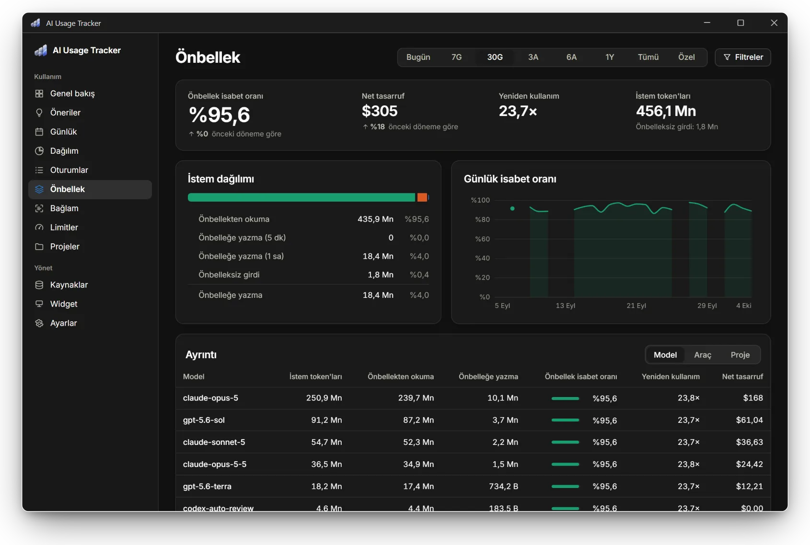                                         |
| --------------------------------------------------------------------------------- | ---------------------------------------------------------------------------------------- |
| **Oturumlar**: her oturumunuz; süresi, modelleri, maliyeti ve en büyük bağlamıyla | **Önbellek**: isabet oranı, yeniden kullanım ve önbelleğin size gerçekte ne kazandırdığı |

| 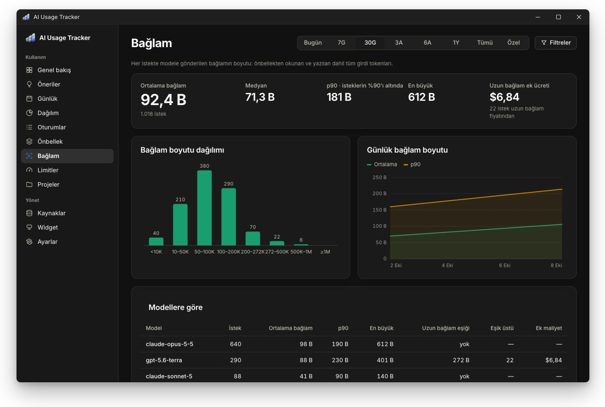                      | 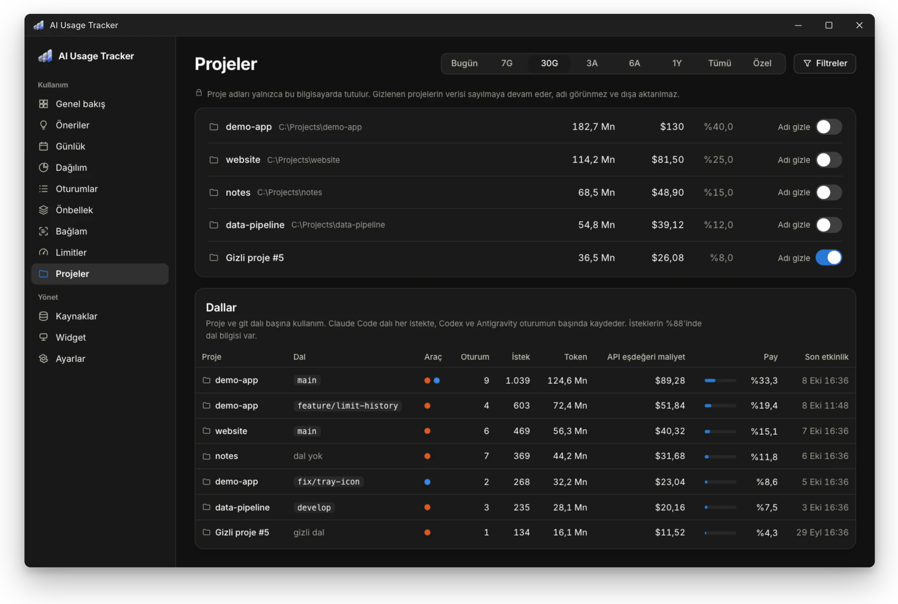 |
| --------------------------------------------------------------------- | --------------------------------------------------- |
| **Bağlam**: istemlerinizin ne kadar büyüdüğü ve uzun bağlam ek ücreti | **Projeler**: proje ve git dalı bazında kullanım   |

**Oturumlar** sayfası dönemdeki her oturumunuzu listeler: başlangıç, proje, modeller, süre (ilk ve son istek arası), istek, token, API eşdeğeri, önbellek isabeti ve en büyük bağlam. Listeyi sıralayabilir ve içinde arama yapabilirsiniz; bir satırı açınca model bazında ayrıntısını görürsünüz. Alt ajan kayıtları ait oldukları oturuma sayılır.

**Bağlam** sayfası her istekte gönderilen bağlamın büyüklüğünü gösterir (önbellekten okunan ve önbelleğe yazılanlar dahil tüm girdi token'ları):

- ortalama, medyan, p90 ve en büyük değer,
- boyut dağılımı (10K altından 1M üstüne kadar),
- günlük ortalama ve p90,
- model bazında dağılım ve **uzun bağlam ek ücreti**: bir modelin uzun bağlam eşiğini (GPT-5.x için 272K) aşan isteklerin standart fiyata göre fazladan tuttuğu tutar.

**Önbellek** sayfasında şunları görürsünüz:

- isabet oranı (önbellekten okunan ÷ istem token'ları),
- yeniden kullanım katsayısı (okuma ÷ yazma). Claude için ve önbellek yazmalarını kaydeden Codex modelleri için hesaplanır; eski Codex kayıtları yalnızca okumaları tuttuğu için hesaba katılmaz,
- 5 dakikalık ve 1 saatlik yazmaların ayrımı,
- günlük isabet oranı,
- model, araç ve projeye göre dağılım,
- **net tasarruf**: önbellekten okunan token'ları tam fiyat yerine indirimli ödediğiniz için kazandığınız tutar; önbelleğe yazma ücreti bundan düşülür. Değer, API eşdeğeridir ve her istek kendi modelinin fiyatıyla hesaplanır.

Net tasarruf eksi çıkıyorsa, yazılan önbellek maliyetini karşılayacak kadar okunmamış demektir.

**Projeler** sayfası her projenin kullanımını git dalına göre ayırır. Claude Code dalı her istekte, Codex ise oturum bir depoda başladığında kaydeder. Depo dışındaki istekler "dal yok" olarak görünür.

### Limitlerinizi masaüstünde görün

Widget her zaman üstte duran küçük bir penceredir. Varsayılan olarak ekranın sağ alt köşesinde, görev çubuğunun hemen üstünde durur. Neleri gösterdiğini ve nasıl göründüğünü **Widget stüdyosu**'nda canlı önizlemeyle değiştirirsiniz.

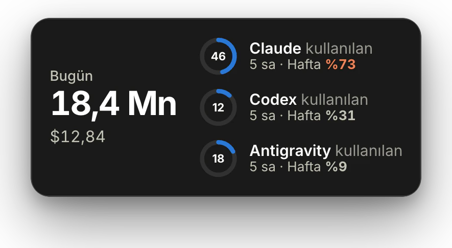

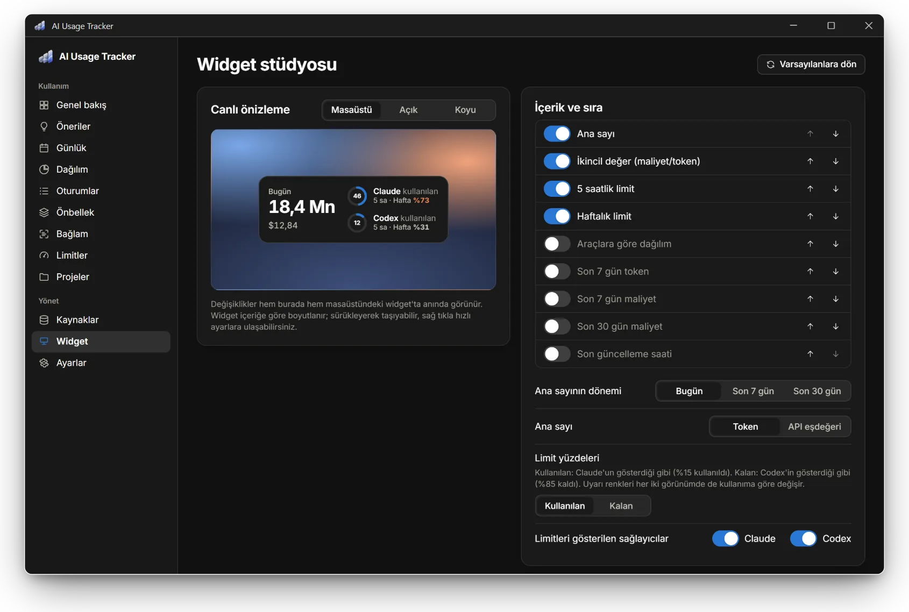

**Widget stüdyosu**'nda şunları ayarlayabilirsiniz:

- **Gösterilenler:** ana sayı, ikincil değer, 5 saatlik ve haftalık limitler, araçlara göre dağılım, 7 ve 30 günlük toplamlar, son güncelleme saati. Her öğeyi açıp kapatabilir ve sırasını değiştirebilirsiniz.
- **Yerleşim:** yatay, dikey ya da tek satır.
- **Limit gösterimi:** halka, çubuk ya da metin.
- **Görünüm:** tema, vurgu rengi, ölçek, arka plan opaklığı, köşe yuvarlaklığı, kenarlık, gölge, etiketler, sıfırlanmaya kalan süre.
- **Yazı:** bilgisayarınızda yüklü herhangi bir yazı tipi (aranabilir; her biri kendi görünümüyle listelenir), yazı boyutu, ana sayı boyutu, sayı kalınlığı, sabit genişlikli rakamlar.
- **Uyarı eşikleri:** dikkat ve kritik seviyeleri.
- **Davranış:** her zaman üstte, konum kilidi, tıklayınca ne olacağı, tam ekranda gizlenme, köşeye yerleştirme, hangi sağlayıcıların gösterileceği.

Widget boyutunu içeriğe göre kendisi ayarlar. Bir köşeye sabitlediyseniz büyüyüp küçülürken o köşede kalır; sürüklerseniz bıraktığınız yerde durur. Sağ tıklayarak hızlı ayarlara ulaşabilirsiniz. Sistem tepsisindeki simge her zaman görünür.

- **Tepsi simgesi** (görev çubuğunda saatin yanında): Bir limitin yüzdesini (o an en dolu olanı ya da sizin seçtiğinizi) widget'ın uyarı renkleriyle gösterebilir. Üzerine geldiğinizde tüm limitler listelenir. Ayarı **Ayarlar → Tepsi simgesi** bölümündedir.
- **Kısayol:** Sistem genelinde bir tuş kısayoluyla widget'ı gösterip gizleyebilirsiniz (varsayılan **Ctrl+Alt+Shift+W**). Değiştirmek için **Ayarlar → Widget** bölümünü kullanabilirsiniz. Başka bir programın kullandığı kısayol kabul edilmez.

### Haftalık rapor alın, verilerinizi yönetin

Haftalık kullanımınızı PDF olarak kaydedebilir, verilerinizi dışa aktarıp yedekleyebilir ve fiyatları kendinize göre düzenleyebilirsiniz.

**Haftalık özet (PDF).** **Ayarlar → Haftalık özet (PDF)** bölümünden geçen haftayı, bu haftayı ya da son 7 günü A4 PDF olarak kaydedebilirsiniz. Özette şunlar yer alır: önceki döneme göre değişimiyle toplamlar, günlük grafik, araçlar, abonelik değeri, tahminleriyle güncel limitler, bağlam, modeller, projeler (gizlediğiniz adlar gizli kalır), en maliyetli oturumlar ve notlar. Yazdırma penceresi açılmaz. İsterseniz son tam haftanın (pazartesi–pazar) özeti, klasörde henüz yoksa her hafta kendiliğinden kaydedilir. Bilgisayar kapalıyken kaçırılan hafta bir sonraki açılışta kaydedilir (varsayılan klasör `Belgeler\AI Usage Tracker`).

**Kalıcı arşiv.** Araçlar kendi kayıtlarını zamanla silebilir. Örneğin Claude Code CLI eski oturumları varsayılan olarak **30 gün** sonra siler; Claude Desktop/Cowork oturumları bunun dışındadır. Uygulama içe aldığı her kaydı kendi veri tabanında tuttuğu için geçmişiniz kaybolmaz. Hiçbir kayıt iki kez sayılmaz (bkz. [Nasıl çalışır](#nasıl-çalışır)).

**Dışa aktarma ve yedek.** **Ayarlar → Veriler** bölümünde şunları yapabilirsiniz:

- CSV ya da JSON olarak dışa aktarma (istek bazında ya da günlük özet),
- veri tabanını yedekleme,
- bir yedeği mevcut verilerle birleştirerek içe aktarma,
- **Tüm verilerimi sil:** Veri tabanını boşaltır ve yeniden onaylayana kadar kayıt almayı durdurur. Başka bir yere kaydettiğiniz yedeklere ve dışa aktarımlara dokunmaz.

**Fiyatlar.**

- Fiyatlar [`config/pricing.json`](config/pricing.json) dosyasındadır ve 2026-10-02'de resmi sayfalardan doğrulanmıştır: [Anthropic](https://platform.claude.com/docs/en/about-claude/pricing), [OpenAI](https://developers.openai.com/api/docs/pricing).
- Hesaba katılan fiyat kalemleri: önbelleğe yazma (5 dk / 1 sa), önbellekten okuma, OpenAI uzun bağlam katmanı (>272K), hızlı mod (fast mode) ve ABD veri yerleşimi çarpanları, web araması ücreti.
- Fiyatı bilinmeyen modeller **maliyete eklenmez** ve "fiyat tanımsız" uyarısıyla listelenir. Ad benzerliğine bakılarak tahmini fiyat atanmaz. **Genel bakış**'taki bu uyarıyı kapatabilirsiniz; yalnızca başka bir model fiyatsız kalırsa yeniden çıkar. Uyarıyı **Ayarlar → Fiyatlar → Uyarıyı tekrar göster** ile de geri getirebilirsiniz.
- Fiyatları **Ayarlar → Fiyatlar** ekranında düzenleyebilirsiniz; düzenlemeleriniz `%LOCALAPPDATA%\AIUsageTracker\pricing.json` dosyasına kaydedilir. Aynı ekranda fiyatsız bir modeli başka bir modelin fiyatıyla hesaplatabilir ya da varsayılan fiyatlara dönebilirsiniz.

## Desteklenen kaynaklar

| Kaynak                                                 | Okunan konum                                                             | Token     | Limit                      | Not                                                                                 |
| ------------------------------------------------------ | ------------------------------------------------------------------------ | --------- | -------------------------- | ----------------------------------------------------------------------------------- |
| **Claude Code** (CLI, VS Code, Claude masaüstü "Code") | `%CLAUDE_CONFIG_DIR%` ya da `%USERPROFILE%\.claude\projects\**\*.jsonl`  | **Kesin** | Yalnızca limit dolduğunda  | Yardımcı arka plan çağrıları (örneğin web araması özetleme) bu kayıtlarda yer almaz |
| **Cowork oturumları** (Claude masaüstü)                | `%APPDATA%\Claude\local-agent-mode-sessions\**`                          | **Kesin** | **Kesin %** (5 sa / 7 gün) | Yalnızca bilgisayarınızda çalışan işler. Yeni Cowork işleri bulutta çalışır: token sayıları bilgisayarınızda tutulmaz ancak plan limitlerinize dahil edilir |
| **Claude masaüstü: plan kullanımı**                    | `%APPDATA%\Claude\plan-usage-history.json`                               | —         | **Kesin %**                | Sohbet token'ları yerelde tutulmadığı için token verisi **yok**                     |
| **Codex** (CLI ve masaüstü)                            | `%CODEX_HOME%` ya da `%USERPROFILE%\.codex\{sessions,archived_sessions}` | **Kesin** | **Kesin %** (her istekte)  |                                                                                     |
| ChatGPT masaüstü                                       | —                                                                        | **Yok**   | —                          | Yalnızca algılanır                                                                  |

Her sayının yanında bir doğruluk etiketi bulunur:

- **Kesin:** Aracın kendi kaydındaki değer.
- **Tahmini:** Uygulamanın hesapladığı değer; örneğin bir projenin limit payı ya da belirlediğiniz bütçeye göre hesaplanan yüzde.
- **Yakalanan:** Uygulamanın canlı okuduğu değer (bkz. [Canlı yakalama](#canlı-yakalama)): limit okuma, durum satırı köprüsü ya da yerel telemetri alıcısı üzerinden gelir.

## Kurulum

1. [Son sürümden](../../releases/latest) `AI-Usage-Tracker_x.y.z_x64-setup.exe` dosyasını indirip çalıştırın. Kurulum yalnızca sizin kullanıcı hesabınıza yapılır ve yönetici yetkisi istemez; uygulama `%LOCALAPPDATA%\AI Usage Tracker` klasörüne kurulur.
2. WebView2 Windows 11'de zaten yüklüdür. Windows 10'da eksikse kurulum dosyası onu da yükler.
3. İlk açılışta bilgisayarınızda bulunan araçlar listelenir. İstediğiniz kaynakları seçip **Başla**'ya basın. Siz onay vermeden hiçbir kayıt okunmaz.

> **SmartScreen uyarısı.** Kurulum dosyası henüz kod imzası taşımadığı için Windows "Bilinmeyen yayımcı" uyarısı gösterebilir. Bu durumda **Ek bilgi → Yine de çalıştır**'ı seçin.

**Kaldırma.** Windows'ta **Ayarlar → Uygulamalar → AI Usage Tracker → Kaldır** yolunu izleyin. Kaldırıcıdaki "Uygulama verilerini sil" kutusunu işaretlerseniz `%LOCALAPPDATA%\AIUsageTracker` klasörü de silinir. "Windows ile başlat" kaydı her durumda temizlenir.

## Gizlilik

> **Prompt ve yanıtlarınız hiçbir zaman saklanmaz.** Uygulama kayıtlardan yalnızca token sayısı, model ve zaman gibi bilgileri alır; prompt ve yanıt metinleri hiçbir yere kaydedilmez. Kullanım verileriniz bilgisayarınızdan hiçbir yere gönderilmez ve uygulamada telemetri yoktur.

- **Okunanlar:** Araçların kendi kayıtlarındaki zaman damgası, model adı, proje klasörü, oturum kimliği, token sayıları ve limit yüzdeleri.
- **Saklananlar:** Yalnızca bu sayılar ve meta veriler (`%LOCALAPPDATA%\AIUsageTracker\tracker.db`, SQLite). Proje adları bu bilgisayardan çıkmaz. İsterseniz adları tek tek ya da toplu olarak gizleyebilirsiniz; gizlenen adlar dışa aktarımlarda da maskelenir.
- **Hiçbir zaman saklanmayanlar:** Prompt ve yanıtlar, dosya içerikleri, kimlik bilgileri ve erişim token'ları. Uygulama, araçların oturum anahtarlarını tutan dosyaları (`.credentials.json`, `auth.json`) **okumaz**.
- **İnternet bağlantısı:** Uygulamanın kendisi internete yalnızca güncelleme denetimi için bağlanır. Bu denetimde yalnızca sürüm dosyası indirilir, hiçbir veri gönderilmez (**Ayarlar → Güncellemeler**). Varsayılan olarak açık gelen limit okumaları bilgisayarınızdaki Claude Code ve Codex'i çalıştırır; bu araçlar limit yüzdenizi kendi servislerinden sorar. Uygulama onları telemetri ve hata raporlaması kapalı olarak başlatır. Limit okumalarını **Kaynaklar → Canlı yakalama** bölümünden kapatabilirsiniz. Fiyat ve plan dosyaları uygulamayla birlikte gelir. Döviz kuru için de internetten veri çekilmez; kuru kendiniz girersiniz.

### Canlı yakalama

**Kaynaklar → Canlı yakalama** bölümünde dört yöntem bulunur. **Claude ve Codex limit okuma varsayılan olarak açıktır.** Bu ikisi için uygulama hiçbir dosyayı değiştirmez, modele istek göndermez ve yalnızca kendi Claude Code / Codex oturumunuzu kullanır. Claude Code'un ayar dosyasını değiştiren diğer iki yöntem **varsayılan olarak kapalıdır**. Her yöntemin neyi değiştirdiği ekranda yazar; yöntemi kapattığınızda değişiklik geri alınır. Uygulamayı kaldırdığınızda da kaldırıcı bu değişiklikleri kendiliğinden geri alır; güncellemelerde ise dokunulmaz.

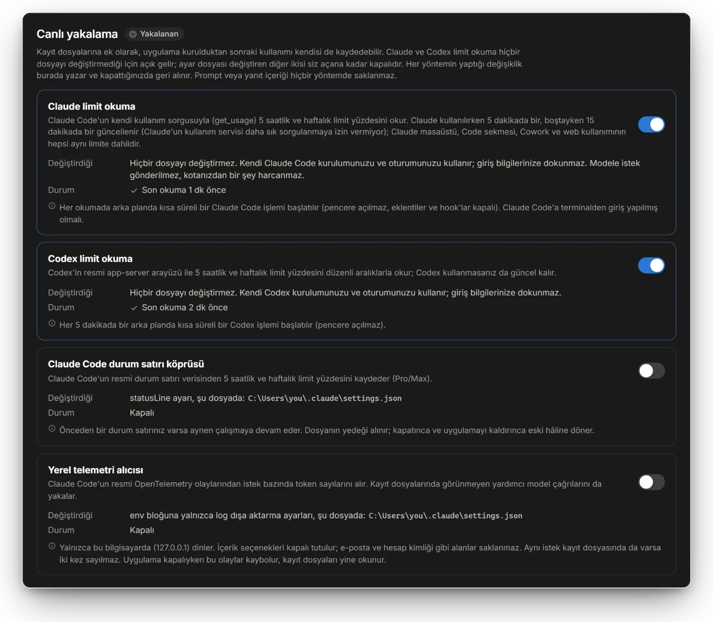

| Yöntem                               | Ne yapar                                                                                                                                                                                                                                                                                                                                                                                                                                                                        | Neyi değiştirir                                                                                                                                                                                                        |
| ------------------------------------ | ------------------------------------------------------------------------------------------------------------------------------------------------------------------------------------------------------------------------------------------------------------------------------------------------------------------------------------------------------------------------------------------------------------------------------------------------------------------------------- | ---------------------------------------------------------------------------------------------------------------------------------------------------------------------------------------------------------------------- |
| **Claude limit okuma**               | Claude Code'un kendi kullanım sorgusuyla 5 saatlik ve haftalık limit yüzdenizi okur. Modele istek gönderilmediği için kotanızdan bir şey harcanmaz. Claude'u kullanırken 5 dakikada bir, kullanmadığınızda 15 dakikada bir güncellenir (Claude'un kullanım servisi daha sık sorulmasına izin vermez). Böylece Claude masaüstü sohbetleri, Code sekmesi, Cowork ve web kullanımı da yansır. Claude Code'da Pro/Max hesabıyla oturum açmış olmanız gerekir (`claude` → `/login`). | Hiçbir şeyi değiştirmez. Kendi Claude Code kurulumunuzu ve oturumunuzu kullanır. Okuma sırasında MCP sunucuları, hook'lar, telemetri, hata raporlaması ve otomatik güncelleme kapalıdır. Giriş bilgilerinize dokunmaz. |
| **Codex limit okuma**                | Codex'in resmi arayüzüyle 5 saatlik ve haftalık limit yüzdenizi 5 dakikada bir okur. Böylece Codex'i kullanmadığınız zamanlarda da değer güncel kalır.                                                                                                                                                                                                                                                                                                                          | Hiçbir dosyayı değiştirmez. Kendi Codex kurulumunuzu ve oturumunuzu analitik kapalı olarak kullanır. Giriş bilgilerinize dokunmaz.                                                                                     |
| **Claude Code durum satırı köprüsü** | Claude Code'un resmi `statusLine` verisinden (Pro/Max) 5 saatlik ve haftalık limit yüzdenizi kaydeder. Zaten bir durum satırınız varsa aynı girdiyle çalışmaya devam eder. Yalnızca Claude Code'un durum satırı gösterdiği yerde (terminalde) çalışır; Claude masaüstündeki Code sekmesi durum satırı çalıştırmaz.                                                                                                                                                              | `~/.claude/settings.json` dosyasındaki `statusLine` alanı (önce yedeği alınır).                                                                                                                                        |
| **Yerel telemetri alıcısı**          | Claude Code'un resmi telemetri verisinden istek bazında token sayılarını alır. Kayıt dosyalarında görünmeyen yardımcı model çağrılarını da yakalar.                                                                                                                                                                                                                                                                                                                             | `~/.claude/settings.json` dosyasındaki `env` bloğuna yalnızca log dışa aktarma değişkenleri eklenir. Alıcı yalnızca `127.0.0.1` adresini dinler ve yalnızca bu kuruluma özel anahtarı taşıyan istekleri kabul eder.    |

Güvenlik önlemleri:

- Hem telemetride hem kayıt dosyasında görünen bir istek bir kez sayılır.
- E-posta adresi ve hesap kimliği gibi bilgiler saklanmaz; prompt kaydı hiçbir zaman açılmaz.
- Kendi telemetri kurulumunuz varsa uygulama ona dokunmaz ve sizi uyarır.
- Bir anahtarı kapattığınızda yalnızca uygulamanın yazdığı değerler geri alınır; sizin yaptığınız değişiklikler korunur.

## Nasıl çalışır

Her şey sizin bilgisayarınızda olur:

1. Claude Code, Cowork, Claude masaüstü ve Codex (CLI ve masaüstü) kullanım kayıtlarını diske yazar.
2. Uygulama bu kayıtları okur ve içlerinden yalnızca token sayısı, model ve zaman gibi bilgileri alır. Prompt ve yanıt metinleri hiçbir yere kaydedilmez.
3. Limit okumaları açıksa limit yüzdeleri bilgisayarınızdaki `claude` ve `codex` üzerinden alınır.
4. Yerel veri tabanına (SQLite) yalnızca sayılar ve meta veriler yazılır.
5. Panel, widget, tepsi simgesi ve PDF özet bu veri tabanını kullanır.

Kayıtlar her seferinde baştan değil, kalınan yerden okunur; yeniden tarama yalnızca yeni eklenen kısmı işler. Aynı yanıtın ara kayıtları ile devam ettirilen ya da kopyalanarak yeni oturuma dönüştürülen sohbetlerdeki tekrarlar ve arşive taşınan Codex dosyaları yalnızca bir kez sayılır.

## Güncellemeler

Uygulama açılışta ve 6 saatte bir yeni sürüm olup olmadığına bakar. Bunun için bu deponun sürümlerinden yalnızca küçük bir sürüm dosyası indirir ve hiçbir veri göndermez. Güncelleme yalnızca siz onayladıktan sonra ve imzası uygulamaya gömülü anahtarla eşleşirse kurulur. Denetimi **Ayarlar → Güncellemeler** bölümünden kapatabilirsiniz.

## Bilinen sınırlamalar

- **Claude Code toplamları:** Claude Code kayıtları ana model dışındaki yardımcı çağrıları içermez. Bu yüzden toplamlar gerçek kullanımın biraz altında kalabilir.
- **Masaüstü sohbetleri:** Claude masaüstü ve ChatGPT masaüstü sohbetlerinin token sayıları yerelde bulunmaz.
- **Codex hızlı katmanı:** Codex fast/priority katmanını istek bazında kaydetmediği için standart fiyat uygulanır.
- **Yalnızca telemetriden bilinen istekler:** Bu isteklerde önbellek yazmaları 5 dakikalık fiyattan hesaplanır, bu yüzden maliyetleri biraz düşük çıkabilir.
- **`codex-auto-review`:** Bu modelin resmi fiyatı yayımlanmamıştır.
- **Kayıt biçimleri:** Araçların kayıt biçimleri resmi olarak belgelenmiş değildir ve sürümden sürüme değişebilir. Uygulama bilmediği alanları atlar ve tanıyamadığı kayıtları **Kaynaklar** ekranında listeler.

## Kaynaktan derleme

Gereksinimler: Rust 1.90+ (MSVC), Node 20.19+ veya 22.12+, Visual Studio Build Tools (C++).

```bash
npm --prefix ui install
cargo test -p tracker-core              # parser, hesaplama ve içe aktarma testleri
npx --prefix ui tauri dev               # geliştirme modu
npm --prefix ui run release             # kurulum dosyası → target/release/bundle/
```

Yalnızca `npm --prefix ui run dev` komutunu çalıştırırsanız panel tarayıcıda örnek verilerle açılır.

| Klasör                | İçerik                                                                                                                 |
| --------------------- | ---------------------------------------------------------------------------------------------------------------------- |
| `crates/tracker-core` | Rust çekirdeği: keşif, ayrıştırıcılar, SQLite arşivi, fiyatlandırma, analiz, dışa aktarma (ve sentetik örnek kayıtlar) |
| `src-tauri`           | Masaüstü kabuğu: arka plan işçisi, dosya izleme, tepsi simgesi, widget, IPC                                            |
| `ui`                  | Svelte 5 arayüzü (panel ve widget)                                                                                     |
| `config`              | `pricing.json`, `plans.json`, `updates.json` (yayın yeri)                                                              |

Hata bildirimlerinizi, pull request'lerinizi ve geri bildirimlerinizi almaktan mutluluk duyarım.

## Kod imzalama politikası

Bkz. [CODE_SIGNING.md](CODE_SIGNING.md).

## Lisans

[MIT](LICENSE)
